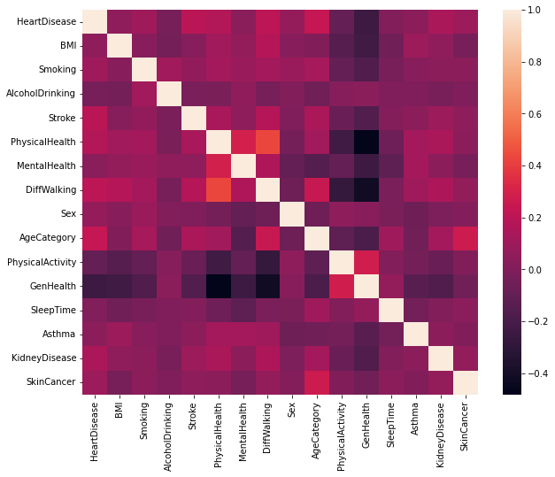
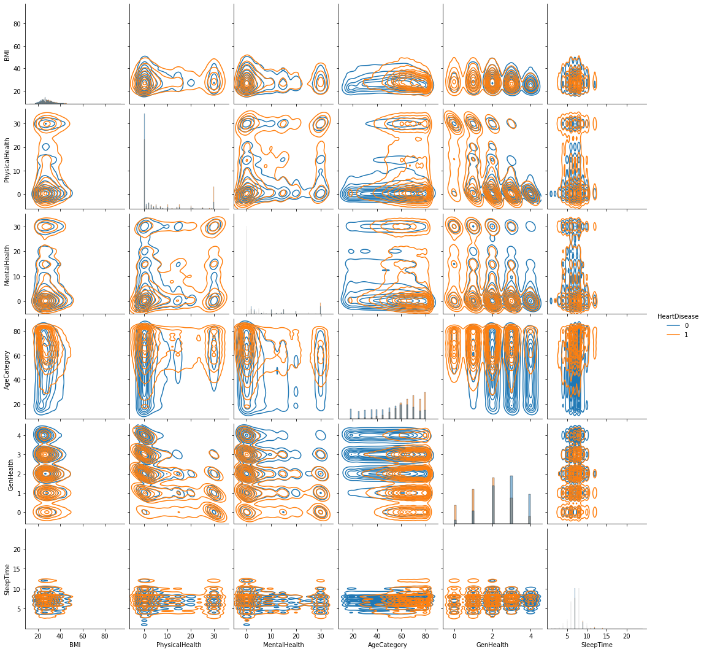

# Introduction to Machine Learning: Supervised Learning
## Final project

## EDA and modelling heart disease information

This notebook contains an exploratory analysis of the *Personal Key Indicators of Heart Disease* dataset from the CDC available on <a href=https://www.kaggle.com/datasets/kamilpytlak/personal-key-indicators-of-heart-disease>Kaggle</a>, the construction of a random forest clasiffier trained to predict if patients reported heart disease in their lifetimes, and an exploration of the resulting model.<br>
Good understanding of factors related to heart disease is of great importance, as it allows to take preventive action and early treatment of heart problems. This notebook is focused on developing a robust model to predict coronary heart disease or myocardial infarction and in understanding the factors related to disease.

## Imports


```python
import pandas as pd
import numpy as np
import matplotlib.pyplot as plt
import seaborn as sns
import datetime
from boruta import BorutaPy
from sklearn.ensemble import RandomForestClassifier
from sklearn.tree import DecisionTreeClassifier
from sklearn.linear_model import LogisticRegression
from sklearn.metrics import (
    make_scorer,
    roc_auc_score,
    RocCurveDisplay,
    plot_confusion_matrix,
    roc_curve,
)
from sklearn.preprocessing import StandardScaler
from sklearn.model_selection import train_test_split, GridSearchCV, cross_val_score
import shap
```


```python
import warnings

warnings.filterwarnings("ignore")
```


```python
%matplotlib inline
%load_ext nb_black
```


 


## EDA

Load data


```python
data = pd.read_csv("../Data/heart_2020_cleaned.csv")
```


 


Transform binary and ordinal attributes into integers for analysis and modelling


```python
ser = data["Diabetic"].copy()
data.replace({"Yes": 1, "No": 0}, inplace=True)
data["Diabetic"] = ser
```


 


```python
data["AgeCategory"].unique()
```


    array(['55-59', '80 or older', '65-69', '75-79', '40-44', '70-74',
           '60-64', '50-54', '45-49', '18-24', '35-39', '30-34', '25-29'],
          dtype=object)


 


```python
data["AgeCategory"] = data["AgeCategory"].apply(lambda x: int(x[:2]))
```


 


```python
data["GenHealth"].unique()
```


    array(['Very good', 'Fair', 'Good', 'Poor', 'Excellent'], dtype=object)


 


```python
data["Sex"].unique()
```


    array(['Female', 'Male'], dtype=object)


 


```python
health_map = {"Poor": 0, "Fair": 1, "Good": 2, "Very good": 3, "Excellent": 4}
sex_map = {"Female": 0, "Male": 1}
```


 


```python
data["GenHealth"] = data["GenHealth"].map(health_map)
data["Sex"] = data["Sex"].map(sex_map)
```


 


```python
data.dtypes
```


    HeartDisease          int64
    BMI                 float64
    Smoking               int64
    AlcoholDrinking       int64
    Stroke                int64
    PhysicalHealth      float64
    MentalHealth        float64
    DiffWalking           int64
    Sex                   int64
    AgeCategory           int64
    Race                 object
    Diabetic             object
    PhysicalActivity      int64
    GenHealth             int64
    SleepTime           float64
    Asthma                int64
    KidneyDisease         int64
    SkinCancer            int64
    dtype: object


 


```python
data["Race"].unique()
```


    array(['White', 'Black', 'Asian', 'American Indian/Alaskan Native',
           'Other', 'Hispanic'], dtype=object)


 


```python
data["Diabetic"].unique()
```


    array(['Yes', 'No', 'No, borderline diabetes', 'Yes (during pregnancy)'],
          dtype=object)


 


Data exploration


```python
binary_columns = [
    x for x in data.nunique()[data.nunique() == 2].index if x != "HeartDisease"
]
```


 


```python
binary_columns
```


    ['Smoking',
     'AlcoholDrinking',
     'Stroke',
     'DiffWalking',
     'Sex',
     'PhysicalActivity',
     'Asthma',
     'KidneyDisease',
     'SkinCancer']


 


```python
data.describe()
```


<div>
<style scoped>
    .dataframe tbody tr th:only-of-type {
        vertical-align: middle;
    }

    .dataframe tbody tr th {
        vertical-align: top;
    }

    .dataframe thead th {
        text-align: right;
    }
</style>
<table border="1" class="dataframe">
  <thead>
    <tr style="text-align: right;">
      <th></th>
      <th>HeartDisease</th>
      <th>BMI</th>
      <th>Smoking</th>
      <th>AlcoholDrinking</th>
      <th>Stroke</th>
      <th>PhysicalHealth</th>
      <th>MentalHealth</th>
      <th>DiffWalking</th>
      <th>Sex</th>
      <th>AgeCategory</th>
      <th>PhysicalActivity</th>
      <th>GenHealth</th>
      <th>SleepTime</th>
      <th>Asthma</th>
      <th>KidneyDisease</th>
      <th>SkinCancer</th>
    </tr>
  </thead>
  <tbody>
    <tr>
      <th>count</th>
      <td>319795.000000</td>
      <td>319795.000000</td>
      <td>319795.000000</td>
      <td>319795.000000</td>
      <td>319795.000000</td>
      <td>319795.00000</td>
      <td>319795.000000</td>
      <td>319795.000000</td>
      <td>319795.000000</td>
      <td>319795.000000</td>
      <td>319795.000000</td>
      <td>319795.000000</td>
      <td>319795.000000</td>
      <td>319795.000000</td>
      <td>319795.000000</td>
      <td>319795.000000</td>
    </tr>
    <tr>
      <th>mean</th>
      <td>0.085595</td>
      <td>28.325399</td>
      <td>0.412477</td>
      <td>0.068097</td>
      <td>0.037740</td>
      <td>3.37171</td>
      <td>3.898366</td>
      <td>0.138870</td>
      <td>0.475273</td>
      <td>52.440945</td>
      <td>0.775362</td>
      <td>2.595028</td>
      <td>7.097075</td>
      <td>0.134061</td>
      <td>0.036833</td>
      <td>0.093244</td>
    </tr>
    <tr>
      <th>std</th>
      <td>0.279766</td>
      <td>6.356100</td>
      <td>0.492281</td>
      <td>0.251912</td>
      <td>0.190567</td>
      <td>7.95085</td>
      <td>7.955235</td>
      <td>0.345812</td>
      <td>0.499389</td>
      <td>18.069747</td>
      <td>0.417344</td>
      <td>1.042918</td>
      <td>1.436007</td>
      <td>0.340718</td>
      <td>0.188352</td>
      <td>0.290775</td>
    </tr>
    <tr>
      <th>min</th>
      <td>0.000000</td>
      <td>12.020000</td>
      <td>0.000000</td>
      <td>0.000000</td>
      <td>0.000000</td>
      <td>0.00000</td>
      <td>0.000000</td>
      <td>0.000000</td>
      <td>0.000000</td>
      <td>18.000000</td>
      <td>0.000000</td>
      <td>0.000000</td>
      <td>1.000000</td>
      <td>0.000000</td>
      <td>0.000000</td>
      <td>0.000000</td>
    </tr>
    <tr>
      <th>25%</th>
      <td>0.000000</td>
      <td>24.030000</td>
      <td>0.000000</td>
      <td>0.000000</td>
      <td>0.000000</td>
      <td>0.00000</td>
      <td>0.000000</td>
      <td>0.000000</td>
      <td>0.000000</td>
      <td>40.000000</td>
      <td>1.000000</td>
      <td>2.000000</td>
      <td>6.000000</td>
      <td>0.000000</td>
      <td>0.000000</td>
      <td>0.000000</td>
    </tr>
    <tr>
      <th>50%</th>
      <td>0.000000</td>
      <td>27.340000</td>
      <td>0.000000</td>
      <td>0.000000</td>
      <td>0.000000</td>
      <td>0.00000</td>
      <td>0.000000</td>
      <td>0.000000</td>
      <td>0.000000</td>
      <td>55.000000</td>
      <td>1.000000</td>
      <td>3.000000</td>
      <td>7.000000</td>
      <td>0.000000</td>
      <td>0.000000</td>
      <td>0.000000</td>
    </tr>
    <tr>
      <th>75%</th>
      <td>0.000000</td>
      <td>31.420000</td>
      <td>1.000000</td>
      <td>0.000000</td>
      <td>0.000000</td>
      <td>2.00000</td>
      <td>3.000000</td>
      <td>0.000000</td>
      <td>1.000000</td>
      <td>65.000000</td>
      <td>1.000000</td>
      <td>3.000000</td>
      <td>8.000000</td>
      <td>0.000000</td>
      <td>0.000000</td>
      <td>0.000000</td>
    </tr>
    <tr>
      <th>max</th>
      <td>1.000000</td>
      <td>94.850000</td>
      <td>1.000000</td>
      <td>1.000000</td>
      <td>1.000000</td>
      <td>30.00000</td>
      <td>30.000000</td>
      <td>1.000000</td>
      <td>1.000000</td>
      <td>80.000000</td>
      <td>1.000000</td>
      <td>4.000000</td>
      <td>24.000000</td>
      <td>1.000000</td>
      <td>1.000000</td>
      <td>1.000000</td>
    </tr>
  </tbody>
</table>
</div>


 


```python
column_correlations = data.corr()
```


 


```python
column_correlations["HeartDisease"].sort_values()
```


    GenHealth          -0.243182
    PhysicalActivity   -0.100030
    AlcoholDrinking    -0.032080
    SleepTime           0.008327
    MentalHealth        0.028591
    Asthma              0.041444
    BMI                 0.051803
    Sex                 0.070040
    SkinCancer          0.093317
    Smoking             0.107764
    KidneyDisease       0.145197
    PhysicalHealth      0.170721
    Stroke              0.196835
    DiffWalking         0.201258
    AgeCategory         0.232325
    HeartDisease        1.000000
    Name: HeartDisease, dtype: float64


 


The atributes that have a greater positive correlation with heart disease are the Age, the difficulty walking and past strokes; while the atributes with greater negative correlation are General health and physical activity.


```python
sns.heatmap(data.corr())
fig = plt.gcf()
fig.set_size_inches(10, 8)
```


    

    


 


```python
data_plot = data.drop(binary_columns, axis=1)
```


 


```python
sample_plot = data_plot[data_plot["HeartDisease"] == 1].copy()
```


 


```python
sample_plot = pd.concat(
    [
        sample_plot,
        data_plot.loc[
            np.random.choice(
                data_plot[data_plot["HeartDisease"] != 1].index,
                len(sample_plot),
                replace=False,
            )
        ],
    ],
)
```


 


```python
sns.pairplot(
    sample_plot,
    hue="HeartDisease",
    kind="kde",
    diag_kind="hist",
)
```


    <seaborn.axisgrid.PairGrid at 0x7ff54c6352e0>


    

    


 


The plot above shows a very clear relation between the possibility of heart disease and other key indicators like age and general health and physical health, 


```python
data[binary_columns + ["HeartDisease"]].groupby("HeartDisease").mean()
```


<div>
<style scoped>
    .dataframe tbody tr th:only-of-type {
        vertical-align: middle;
    }

    .dataframe tbody tr th {
        vertical-align: top;
    }

    .dataframe thead th {
        text-align: right;
    }
</style>
<table border="1" class="dataframe">
  <thead>
    <tr style="text-align: right;">
      <th></th>
      <th>Smoking</th>
      <th>AlcoholDrinking</th>
      <th>Stroke</th>
      <th>DiffWalking</th>
      <th>Sex</th>
      <th>PhysicalActivity</th>
      <th>Asthma</th>
      <th>KidneyDisease</th>
      <th>SkinCancer</th>
    </tr>
    <tr>
      <th>HeartDisease</th>
      <th></th>
      <th></th>
      <th></th>
      <th></th>
      <th></th>
      <th></th>
      <th></th>
      <th></th>
      <th></th>
    </tr>
  </thead>
  <tbody>
    <tr>
      <th>0</th>
      <td>0.396246</td>
      <td>0.070569</td>
      <td>0.026263</td>
      <td>0.117577</td>
      <td>0.464572</td>
      <td>0.788135</td>
      <td>0.129741</td>
      <td>0.028466</td>
      <td>0.084942</td>
    </tr>
    <tr>
      <th>1</th>
      <td>0.585869</td>
      <td>0.041683</td>
      <td>0.160340</td>
      <td>0.366346</td>
      <td>0.589596</td>
      <td>0.638914</td>
      <td>0.180214</td>
      <td>0.126219</td>
      <td>0.181931</td>
    </tr>
  </tbody>
</table>
</div>


 


As seen in the table above smoking, previous stroke episodes, difficulty walking, physical activity, Asthma, kidney disease and skin cancer are all related with hearth disease, while alcohol drinking has little incidence.

There seems to be a relation between the incidence of heart disease and the sex of the person as the proportion of men in the dataset with heart disease is greater than the proportion of women. This relation has to be explored further as it may be explained when considering the effect of other variables.

# Modelling

Lets construct some machine learning models to see if we are able to predict hearth disease from the other variables.


```python
data = pd.get_dummies(data, drop_first=True)
```


 


```python
X_train, X_test, y_train, y_test = train_test_split(
    data.drop("HeartDisease", axis=1), data["HeartDisease"], test_size=0.2
)
```


 


```python
train_ss = pd.DataFrame(
    columns=[x for x in data.columns if x != "HeartDisease"],
    data=StandardScaler().fit_transform(data.drop("HeartDisease", axis=1)),
)
```


 


```python
X_train_ss = train_ss.loc[X_train.index]
```


 


```python
X_test_ss = train_ss.loc[X_test.index]
```


 


```python
def roc_auc_scorer(estimator, X, y):
    return roc_auc_score(y, estimator.predict_proba(X)[:, 1])
```


 


### Logistic regresion

First let's fit a logistic regresion in order to have a baseline model


```python
log_model = LogisticRegression().fit(X_train_ss, y_train)
```


 


```python
print(
    f"Logistic accuracy: {np.mean(cross_val_score(log_model, X_train_ss, y_train, cv=4))}"
)
```

    Logistic accuracy: 0.9158210728748104


 


```python
print(
    f"Logistic ROC AUC: {np.mean(cross_val_score(log_model, X_train_ss, y_train, cv=4, scoring=roc_auc_scorer))}"
)
```

    Logistic ROC AUC: 0.8404060735215327


 


```python
coefs_log = (
    pd.DataFrame(
        index=list(X_train_ss.columns),
        columns=["Coef"],
        data=log_model.coef_.T,
    )
    .sort_values("Coef")
    .reset_index()
)
```


 


```python
coefs_log.loc[
    coefs_log["Coef"].apply(lambda x: abs(x)).sort_values(ascending=False).index
].head()
```


<div>
<style scoped>
    .dataframe tbody tr th:only-of-type {
        vertical-align: middle;
    }

    .dataframe tbody tr th {
        vertical-align: top;
    }

    .dataframe thead th {
        text-align: right;
    }
</style>
<table border="1" class="dataframe">
  <thead>
    <tr style="text-align: right;">
      <th></th>
      <th>index</th>
      <th>Coef</th>
    </tr>
  </thead>
  <tbody>
    <tr>
      <th>22</th>
      <td>AgeCategory</td>
      <td>0.980381</td>
    </tr>
    <tr>
      <th>0</th>
      <td>GenHealth</td>
      <td>-0.520062</td>
    </tr>
    <tr>
      <th>21</th>
      <td>Sex</td>
      <td>0.348751</td>
    </tr>
    <tr>
      <th>20</th>
      <td>Stroke</td>
      <td>0.199082</td>
    </tr>
    <tr>
      <th>19</th>
      <td>Smoking</td>
      <td>0.176382</td>
    </tr>
  </tbody>
</table>
</div>


 


The baseline logistic regresion model achieves a 92% accuracy and a roc auc score of 0.84 in the validation set. The most important attribues according to the coefficient norm are Age category, general health, sex, and stroke and smoking history.

### Random Forest

Now let's try with a random forest to see if we can improve the achieved results


```python
imbalance_factor = 1 / data["HeartDisease"].mean()
```


 


```python
def gen_rf_hyperparameters():
    n_estimators = max(int(10 ** (np.random.random() * 1.5 + 1)), 1)
    max_depth = np.random.choice([1, 2, 5, 10, 20])
    min_samples_leaf = np.random.randint(1, 100)
    class_weight = {0: 1, 1: (np.random.random() + 1) * imbalance_factor}
    max_features = np.random.random()
    return {
        "n_estimators": n_estimators,
        "max_depth": max_depth,
        "min_samples_leaf": min_samples_leaf,
        "class_weight": class_weight,
        "max_features": max_features,
    }
```


 


### Cross validation

Now the hyperparameters for the model are going to be selected through 50 iterations of cross-validation.


```python
n_cv = 50
```


 


```python
score = 0.5
final_params_allcols = None
```


 


```python
for i in range(n_cv):
    if i % 5 == 0:
        print(
            f"Iteration {i+1} - {n_cv}: CV - {datetime.datetime.today().strftime('%H:%M:%S')}"
        )
    params = gen_rf_hyperparameters()
    model = RandomForestClassifier(**params)
    cv_score = np.mean(
        cross_val_score(
            model,
            X_train,
            y_train,
            cv=4,
            scoring=roc_auc_scorer,
        )
    )
    if cv_score > score:
        score = cv_score
        final_params_allcols = params
        print(f"Iter {i} - ROC AUC score :{score}")
```

    Iteration 1 - 50: CV - 15:55:31
    Iter 0 - ROC AUC score :0.8027481045921633
    Iter 1 - ROC AUC score :0.8304528096551451
    Iter 4 - ROC AUC score :0.8324311949141636
    Iteration 6 - 50: CV - 15:56:32
    Iter 5 - ROC AUC score :0.8384203626875769
    Iter 8 - ROC AUC score :0.8393541990919462
    Iteration 11 - 50: CV - 16:02:09
    Iter 13 - ROC AUC score :0.8411070736527291
    Iteration 16 - 50: CV - 16:03:23
    Iteration 21 - 50: CV - 16:04:20
    Iteration 26 - 50: CV - 16:06:03
    Iteration 31 - 50: CV - 16:08:07
    Iteration 36 - 50: CV - 16:12:21
    Iter 36 - ROC AUC score :0.842111168781905
    Iteration 41 - 50: CV - 16:14:53
    Iteration 46 - 50: CV - 16:16:53


 


The AUC ROC cross-validated score is similar to the one of the logistic regresion, just a little bit higher. Now, feature selection will be developed to see if the resulting model can be improved.

### Feature selection

In order to do feature selection the Boruta method will be used. This method trains multiple models on the dataset including permutations of columns and does a statistical test based on the feature importances of the attribute and its permutation, in order to select which attributes have predictive power. Further information about Boruta can be found in the <a href=https://danielhomola.com/boruta_py>documentation</a>.


```python
bor_iter = 5
columns_to_retain = set()
for i in range(bor_iter):
    print(
        f"Iteration {i+1} - {bor_iter}: Boruta - {datetime.datetime.today().strftime('%H:%M:%S')}"
    )
    params = gen_rf_hyperparameters()
    model = RandomForestClassifier(**params)
    boruta = BorutaPy(estimator=model, n_estimators="auto", max_iter=100)
    boruta.fit(
        np.array(X_train),
        np.array(y_train),
    )
    columns_to_retain = columns_to_retain.union(
        X_train.columns[boruta.support_].to_list()
    )
    if len(columns_to_retain) == len(X_train.columns):
        print(f"All columns were found important")
        break
print(f"Columns to retain: {columns_to_retain}")
```

    Iteration 0 - 5: Boruta - 16:28:15
    Iteration 1 - 5: Boruta - 16:32:10
    Iteration 2 - 5: Boruta - 17:12:41
    Iteration 3 - 5: Boruta - 17:13:19
    Iteration 4 - 5: Boruta - 17:24:40
    Columns to retain: {'Smoking', 'GenHealth', 'AgeCategory', 'Race_White', 'Stroke', 'SleepTime', 'SkinCancer', 'DiffWalking', 'MentalHealth', 'KidneyDisease', 'PhysicalActivity', 'BMI', 'Diabetic_Yes', 'PhysicalHealth', 'Sex'}


 


```python
score = 0.5
final_params = None
```


 


```python
for i in range(n_cv):
    if i % 5 == 0:
        print(
            f"Iteration {i+1} - {n_cv}: CV - {datetime.datetime.today().strftime('%H:%M:%S')}"
        )
    params = gen_rf_hyperparameters()
    model = RandomForestClassifier(**params)
    cv_score = np.mean(
        cross_val_score(
            model,
            X_train[columns_to_retain],
            y_train,
            cv=4,
            scoring=roc_auc_scorer,
        )
    )
    if cv_score > score:
        score = cv_score
        final_params = params
        print(f"Iter {i} - ROC AUC score :{score}")
```

    Iteration 1 - 50: CV - 17:36:35
    Iter 0 - ROC AUC score :0.8359097760211274
    Iter 1 - ROC AUC score :0.8393963752946834
    Iteration 6 - 50: CV - 17:37:25
    Iter 7 - ROC AUC score :0.8395562376428167
    Iteration 11 - 50: CV - 17:38:48
    Iteration 16 - 50: CV - 17:44:24
    Iter 15 - ROC AUC score :0.8412336362704519
    Iteration 21 - 50: CV - 17:47:18
    Iteration 26 - 50: CV - 17:48:15
    Iteration 31 - 50: CV - 17:49:33
    Iteration 36 - 50: CV - 17:53:05
    Iteration 41 - 50: CV - 17:55:45
    Iteration 46 - 50: CV - 18:01:53


 


The model has a similar ROC AUC score as the logistic regresion model and the random forest with all features. Feature selection is usefull as it allows to produce a simpler model with similar predictive power.<br>
In this case I would recomend to stick with the logistic regresion as it is simpler and much more explainable. In order to overcome the lesser explainability of models like random forest, there have been developed tools like shapely additive values which we will now explore.


```python
model_rf = RandomForestClassifier(**final_params)
```


 


```python
model_rf.fit(X_train[columns_to_retain], y_train)
```


    RandomForestClassifier(class_weight={0: 1, 1: 16.446937105618545}, max_depth=10,
                           max_features=0.29989989212796664, min_samples_leaf=45,
                           n_estimators=153)


 


#### SHAP

Let's use Shapely Additive values to explore feature importance and contribution. This methodology allows to estimate the marginal contribution of each feature for every prediction. More information about the topic is available <a href=https://christophm.github.io/interpretable-ml-book/shapley.html>here</a>.


```python
explainer = shap.TreeExplainer(model_rf)
```


 


```python
shap_values = explainer.shap_values(X_test[columns_to_retain], y_test)
```


 


The following plot shows the shapely values which can interpreted as the marginal contribution towards the prediction for each record attribute of the test set. One point in the following graph in the AgeCategory column represents a single observation whose AgeCategory value is encoded in the color (so older people are red dots), and has the marginal contribution calculated plotted in the x-axis. An easier way to interpret the graph is by understanding the width of the point cloud as the feature importance and by knowing that if red points are on the right of the plot, then there is a positive correlation between the feature and heart disease, and viceversa.

This plot shows that the most important factors contributing to the risk of heart disease are age and general well beign, followed by sex, diabetes, dificulty walking, previous stroke episodes and smoking.


```python
shap.summary_plot(shap_values[1], X_test[columns_to_retain])
```


    

    


 


## Metrics

Now let's evaluate the performance of the models by plotting the resulting ROC curves and confusion matrices.


```python
y_test_pred_proba = model_rf.predict_proba(X_test[columns_to_retain])
```


 


```python
y_test_pred_proba_log = log_model.predict_proba(X_test_ss)
```


 


```python
fig, ax = plt.subplots()
RocCurveDisplay.from_predictions(
    y_test,
    y_test_pred_proba[:, 1],
    ax=ax,
    label=f"RF model - Test ROC AUC:{round(roc_auc_score(y_test, y_test_pred_proba[:, 1]),3)}",
)
RocCurveDisplay.from_predictions(
    y_test,
    y_test_pred_proba_log[:, 1],
    ax=ax,
    label=f"Logistic model - Test ROC AUC:{round(roc_auc_score(y_test, y_test_pred_proba_log[:, 1]),3)}",
)
```


    <sklearn.metrics._plot.roc_curve.RocCurveDisplay at 0x7fc07f16f5e0>


    

    


 


Both models, the logistic regresion and the random forest achieve considerable predictive power. The confusion matrix shown below is evidence of the utility of the model as they can identify high risk individuals so that preventive measures can be taken.


```python
plot_confusion_matrix(model_rf, X_test[columns_to_retain], y_test)
```


    <sklearn.metrics._plot.confusion_matrix.ConfusionMatrixDisplay at 0x7fc07f0a6490>


    

    


 


```python

```
